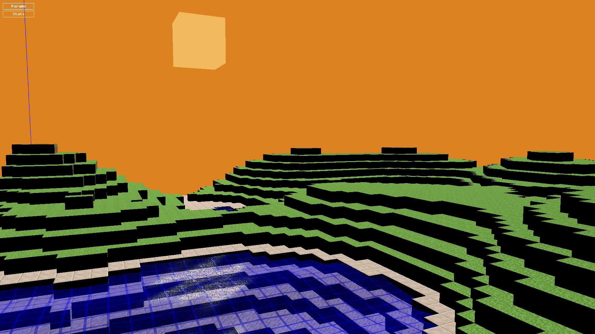
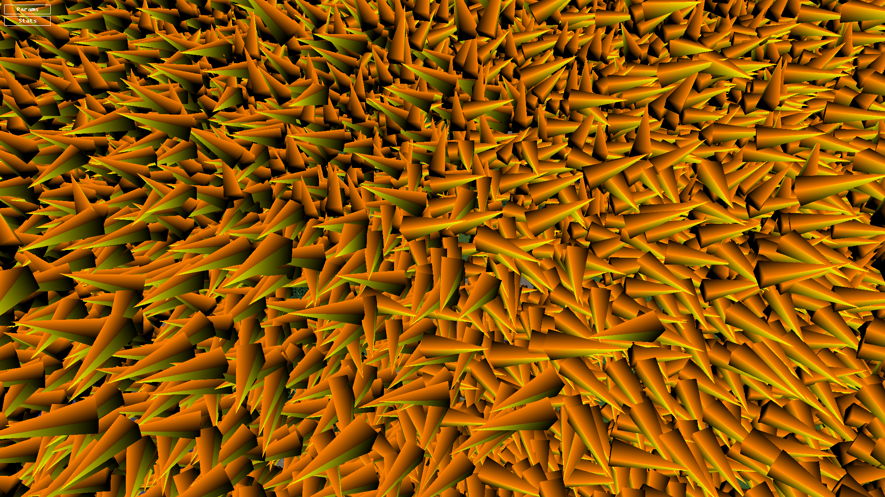
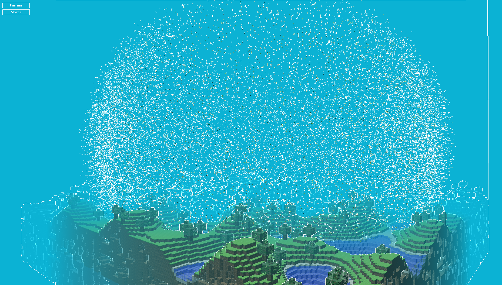

# Engine Programming

# Presentation

This is 3D game engine school project. The engine is developped in C++ using **OpenGL** and the goal is to recreate a minecraft like environment

## Topics
- Graphic pipeline
- VAO, VBO
- MVP Matrices
- Vertex/Fragment Shader

## Features
- ### System
- - - [x] Procedural world generation
- - - [x] Day/Night cycle
- - - [x] Water deformation

- ### Shaders
- - - [x] Ambient light
- - - [x] Diffuse light
- - - [x] Specular light

- ### Controller
- - - [x] Avatar FPS movements
- - - [x] Physic interactions (gravity, jump...)
- - - [x] Removing block mechanic

## Personnal features added
- UV texturing
- Displacement mapping
- Tree generation
- More coherent land generation
- Add *"birds"* using geometry shader
- In-water post process effects

---
## Demo

## Screeshots

More screenshots can be seen [here](Screenshots/)

## Possible improvements
- Optimise land generation
- Implement Boids system for *"birds"*
- Add lighting effects like god rays